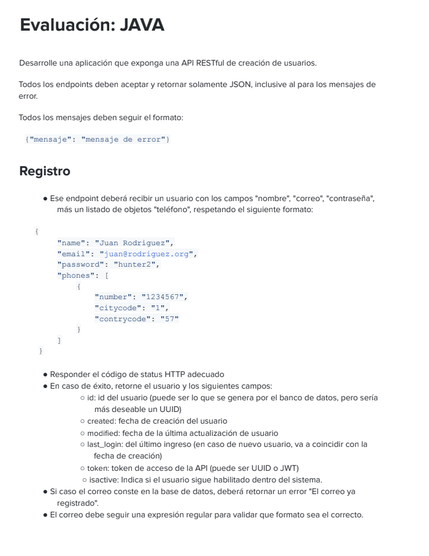

# Mi solución para el Test de [Global Logic](https://www.globallogic.com/latam/) 💪

### Indice

- [Descripción](#descripción)

- [Features](#features)

- [Technologies & Tools](#-technologies--tools)

- [Run on local](#run-on-local)

- [Test evidences](#test-evidences)

- [Authors](#authors)

---------------------------------------------------------------------------------------------------------------------------------------------------------------------------------

## Descripción

Desarrolle una aplicación que exponga una API RESTful de gestión de usuarios.

## Features

✅ `Feature 1:` Creación de usuario

✅ `Feature 2:` Listado de usuarios con JWT Token

---------------------------------------------------------------------------------------------------------------------------------------------------------------------------------

## 🛠 Technologies & Tools

- **Language:** Java 21
- **Framework :** Spring Boot 3
- **Web framework :** Spring Rest
- **Data framework :** Spring Data JPA
- **Database :** H2
- **Versionador de Base de datos :** Liquibase
- **Api Docs :** Spring Doc
- **Spock :** Spock test framework

---------------------------------------------------------------------------------------------------------------------------------------------------------------------------------

## Run on local

1. Clonar el repo
2. Instalar java 21 (con SDK Man o desde instalador)
3. Dentro del repo en la consola ejecutar `./gradlew test` para correr los unit test del proyecto (macos / linux) / `gradlew.bat test` (windows)
4. Dentro del repo en la consola ejecutar `./gradlew spring-boot:run` para iniciar la APP / `gradlew.bat spring-boot:run` (windows). El proyecto corre por defecto en el puerto 8080.
5. Usar la colección de Postman para probar [Postman collection](readme-files/GlobalLogic.postman_collection.json) dentro de el esta el endpoint para probar y los ejemplos para probar los casos de excepción.
6. Asimismo se puede acceder al swagger-ui [Swagger UI](http://localhost:8080/swagger-doc/swagger-ui/index.html)

## Test evidences

-------------------------------------------------------------------------------------------------------------------------------------------------------------------------

## Authors

| [ Samuel Gonzales](https://github.com/samusfree) |  
|:---------------------------------------------------------------------------------------------------------------------------------------:|
